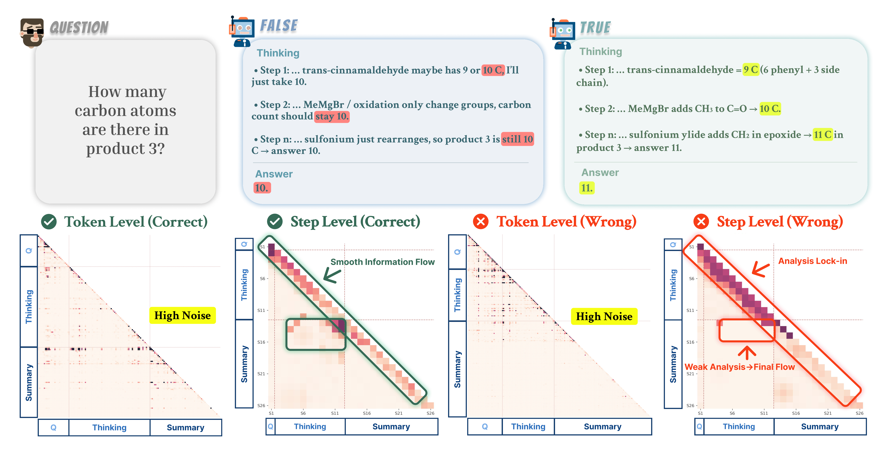
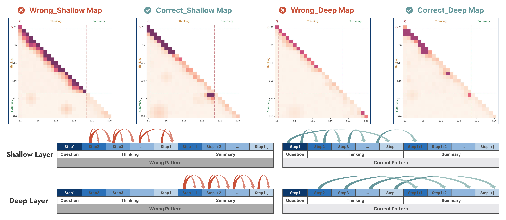

# Reasoning Fails Where Step Flow Breaks

<p align="center">
  🎉 <b>Accepted to ACL 2026 Main Conference (CCF-A)</b> 🎉
</p>

<p align="center">
  <a href="https://arxiv.org/abs/2604.06695">Paper</a> &nbsp;|&nbsp;
  <a href="https://arxiv.org/pdf/2604.06695">PDF</a> &nbsp;|&nbsp;
  <a href="https://github.com/XiaoyuXu-Vincent/step-saliency">Code</a>
</p>

<p align="center">
  <b>Xiaoyu Xu</b><sup>1,2</sup>,
  <b>Yulan Pan</b><sup>2</sup>,
  <b>Xiaosong Yuan</b><sup>3‡</sup>,
  <b>Zhihong Shen</b><sup>2</sup>,
  <b>Minghao Su</b><sup>2</sup>,
  <b>Yuanhao Su</b><sup>2</sup>,
  <b>Xiaofeng Zhang</b><sup>1†</sup>
</p>

<p align="center">
  <sup>1</sup>Shanghai Jiao Tong University &nbsp;&nbsp;
  <sup>2</sup>Fuzhou University &nbsp;&nbsp;
  <sup>3</sup>Jilin University
</p>

<p align="center">
  <sup>†</sup>Corresponding author &nbsp;&nbsp; <sup>‡</sup>Project leader
</p>

---

## Abstract

Large reasoning models (LRMs) that generate long chains of thought now perform well on multi-step math, science, and coding tasks. However, their behavior is still unstable and hard to interpret, and existing analysis tools struggle with such long, structured reasoning traces. We introduce **Step-Saliency**, which pools attention–gradient scores into step-to-step maps along the question–thinking–summary trajectory. Across several models, Step-Saliency reveals two recurring information-flow failures: **Shallow Lock-in**, where shallow layers over-focus on the current step and barely use earlier context, and **Deep Decay**, where deep layers gradually lose saliency on the thinking segment and the summary increasingly attends to itself and the last few steps. Motivated by these patterns, we propose **StepFlow**, a saliency-inspired test-time intervention that adjusts shallow saliency patterns via Odds-Equal Bridge and adds a small step-level residual in deep layers via Step Momentum Injection. StepFlow improves accuracy on math, science, and coding tasks across multiple LRMs without retraining, indicating that repairing information flow can recover part of their missing reasoning performance.

## Key Contributions

1. **Step-Saliency**: A step-level diagnostic tool that aggregates token-level attention–gradient saliency into step→step maps, making long reasoning traces interpretable at the step level.

2. **Two failure patterns identified**: We discover two depth-wise information-flow failures in large reasoning models:
   - **Shallow Lock-in** — shallow layers over-attend to the current step and under-use earlier reasoning context.
   - **Deep Decay** — deep layers progressively lose saliency on the thinking segment; the summary increasingly attends only to itself and the last few steps.

3. **StepFlow**: A test-time intervention (no retraining required) that repairs information flow via two mechanisms:
   - **Odds-Equal Bridge (OEB)** — redistributes attention mass in shallow layers to restore cross-step flow.
   - **Step Momentum Injection (SMI)** — injects a small step-level residual in deep layers to counteract saliency decay.

   StepFlow consistently improves accuracy across DeepSeek-R1-Distill (7B/14B/32B), GPT-OSS-20B, and QwQ-32B on AIME24, AIME25, AMC23, MATH-500, GPQA-Diamond, and LiveCodeBench.

## Figures

<p align="center">
  
</p>
<p align="center"><em>Figure 1: Token-level saliency maps are dense and noisy; Step-Saliency pools them into question/thinking/summary blocks. Correct traces show smooth information flow, while errors exhibit shallow lock-in and weak thinking→summary links.</em></p>

<p align="center">
  
</p>
<p align="center"><em>Figure 2: Step-Saliency patterns for shallow vs. deep layers and correct vs. error traces. Shallow Lock-in (narrow local flow in error traces) and Deep Decay (faster saliency loss in deep layers).</em></p>

## Project Structure

```
saliency/
  src/
    generate_saliency_maps.py   # Generate step-level saliency maps
    saliency_extractor.py       # Universal attention saliency extractor
    model_config.py             # Model configurations (GPT-OSS, DeepSeek, QwQ)
    interventions/
      attention_manager.py      # Attention hook manager for interventions
      bridge_guard_oeb.py       # Odds-Equal Bridge (OEB) implementation
      smi.py                    # Step Momentum Injection (SMI) implementation
      state_controller.py       # State tracking for channel segments
  scripts/
    eval_gpqa_aqr.py            # GPQA-Diamond evaluation
    eval_livecodebench.py       # LiveCodeBench evaluation
    analyze_step_saliency.py    # Step saliency analysis
    run_gpqa.sh                 # Run GPQA evaluation
    run_math.sh                 # Run MATH evaluation
    run_livecodebench.sh        # Run LiveCodeBench evaluation
  eval/
    Math-main/                  # MATH benchmark evaluation
```

## Installation

```bash
pip install -r requirements.txt
```

GPT-OSS model support requires a custom `transformers` build that includes `transformers.models.gpt_oss`. DeepSeek-R1-Distill and QwQ models work with the standard `transformers` package.

## Usage

### Generate Saliency Maps

```bash
python src/generate_saliency_maps.py \
    --model-path /path/to/model \
    --dataset math \
    --output-dir outputs/saliency
```

### Run StepFlow Evaluations

GPQA-Diamond:

```bash
bash scripts/run_gpqa.sh --model-path /path/to/model
```

MATH:

```bash
MODEL_PATH=/path/to/model bash scripts/run_math.sh
```

LiveCodeBench:

```bash
bash scripts/run_livecodebench.sh --model-path /path/to/model
```

### Hyperparameters

Default StepFlow configuration (Table 8 in paper):

| Model | OEB layers | SMI layers | tau_max | alpha |
|-------|-----------|-----------|---------|-------|
| R1-Distill-7B/14B/32B | bottom 1/4 | top 1/4 | 0.15 | 0.06 |
| GPT-OSS-20B | bottom 1/4 | top 1/4 | 0.15 | 0.06 |
| QwQ-32B | bottom 1/4 | top 1/4 | 0.15 | 0.06 |

Override via CLI:

```bash
--smi-strength 0.06       # SMI residual scale alpha
--oeb-layers 1,3,5,7     # Specific OEB layers
--tau-max 0.15            # OEB bridge mass upper bound
```

## Citation

```bibtex
@inproceedings{xu2026reasoning,
  title={Reasoning Fails Where Step Flow Breaks},
  author={Xu, Xiaoyu and Pan, Yulan and Yuan, Xiaosong and Shen, Zhihong and Su, Minghao and Su, Yuanhao and Zhang, Xiaofeng},
  booktitle={Proceedings of the 64th Annual Meeting of the Association for Computational Linguistics (ACL)},
  year={2026}
}
```

## License

This project is released under the [Apache License 2.0](LICENSE).
